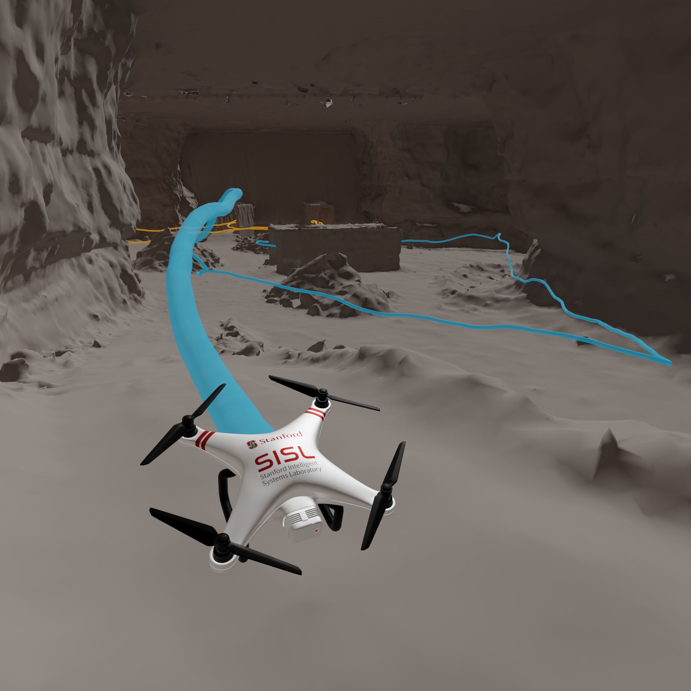

# Prospector



Prospector is a simulation environment for single- and multi-agent rotorcraft in real
3D cave geometry. It provides:

- **Cave maps** voxelized from real 3D scans: the *tunnels* and *chamber* sections of the
  DARPA Subterranean Challenge Final Event course, and the *Grapevine* cave.
- **Quadrotor dynamics**: a 12-state rigid-body model (RK4 at 100 Hz, drag, thrust-to-weight
  ratio 2) with a cascaded velocity/attitude controller. This is the default. A simple
  kinematic model is also available.
- **Model predictive path integral (MPPI) control** with collision checking against the map.
- **Multi-agent communication** by line of sight on the map, and **graph generation**
  (traversability and coordination graphs) for planning.
- **Tour benchmarking**: fly step-aligned multi-agent node tours with communication
  rendezvous, repeated over many trials, with statistics export.
- **Rendering**: real-time matplotlib videos, and Blender renders of the simulated flights.

# Prerequisites

- [uv](https://docs.astral.sh/uv/getting-started/installation/)
- `curl`, used to fetch the large assets
- [Blender](https://www.blender.org/download/) 5.0 or newer, only for Blender rendering
- [rclone](https://rclone.org/downloads/), only if you will *upload* assets

# Setup

```bash
uv sync
./scripts/assets-pull.sh
```

Large 3D assets (`.ply` / `.blend`) are not stored in git. They live in a public Backblaze
B2 bucket and `assets-pull.sh` downloads them (no credentials needed; re-run it to resume
an interrupted download). See [`scripts/ASSETS.md`](scripts/ASSETS.md) for details, and for
how maintainers upload new or changed assets.

```
src/assets/
├── point_clouds/            # cave scans, loaded by caves.<name>.relative_path
│   ├── tunnels.ply            # DARPA SubT Final Event, section 6
│   ├── chamber.ply            # DARPA SubT Final Event, section 5
│   ├── combined.ply           # tunnels + chamber joined by connector tunnels
│   ├── grapevine-exped-3.ply  # Grapevine cave (latest survey, used by default)
│   └── grapevine-exped-2.ply  # Grapevine cave (earlier survey, archived)
├── blender/
│   └── cave-maps.blend        # Blender scene: cave meshes, cameras, quadrotor model
├── graphs/n=<N>/<cave>_3d.json  # node/edge graphs (tracked in git)
├── graphs/docs/               # graph figures (tracked in git)
└── tours/example_tours.json   # example multi-agent tour for the benchmark
```

The first run on each cave voxelizes its scan and caches the map in `saved/cache/`. Outputs
go to timestamped folders in `logs/`.

# Running

All scripts use [Hydra](https://hydra.cc) with `src/prospector/conf/config.yaml`, so any
setting can be overridden on the command line (`key=value`).

## Caves and graphs

```bash
# Plot cave visuals (2D and 3D) for the caves in this repo
uv run python -m prospector.tests.test_cave_visuals
# Generate traversability / coordination graphs automatically, or from the provided graphs
uv run python -m prospector.tests.test_cave_graphs_automatic
uv run python -m prospector.tests.test_cave_graphs_manual
# Top-down graph figures (no axes); 'footprint' for multi-level caves, 'slice' for the 2D slice
uv run python -m prospector.caves.plotting.graph_topdown_figure \
    grapevine-exped-3 "src/assets/graphs/n=15/grapevine-exped-3_3d.json" <out_dir> footprint
```

## Simulation

```bash
# Waypoint following with the config.yaml parameters (12-state quadrotor by default)
uv run python -m prospector.tests.test_simulation
uv run python -m prospector.tests.test_simulation simulation.cave=chamber
# Simple kinematic model instead
uv run python -m prospector.tests.test_simulation simulation.dynamics_model=dynamics_3d_linear
```

The video plays in real time at `simulation.render.fps` (default 30). Frames between 0.1 s
control steps are interpolated, and each run ends with a 2 s hold.

## Multi-agent tour benchmark

A tour file gives, for each cave, step-aligned node paths per agent over a graph, plus the
steps after which the agents are in contact (see `src/assets/tours/example_tours.json`).
Agents fly their own paths at their own pace. At each contact step, every agent holds at its
node until all agents have arrived and have line of sight, then all continue. Each tour is
flown `benchmark.num_trials` times in parallel.

```bash
uv run python -m prospector.benchmarks.benchmark_tours
uv run python -m prospector.benchmarks.benchmark_tours benchmark.num_trials=2 "benchmark.run_instances=[tunnel_3d_025]"
# CSV statistics (per trial / agent / waypoint / rendezvous, and a summary)
uv run python -m prospector.benchmarks.export_stats logs/<run>_benchmark_tours --tag full_dynamics
# LaTeX results table from those CSVs
uv run python -m prospector.benchmarks.make_latex_table logs/<run>_benchmark_tours full_dynamics table.tex
```

Each trial folder holds `result.json`, per-step `infos.json`, and `trajectories/agent_*.{npz,json}`.
The `benchmark.video_trials` trials also get a real-time video. To use your own tours, point
`benchmark.tours_file` at your file and map each tour instance to a cave and graph under
`benchmark.instances`.

## Blender rendering

Rendering uses `src/assets/blender/cave-maps.blend` and needs Blender 5.0+. Set
`blender.blender_executable_path` to your Blender executable (the default, `blender`,
looks it up on your PATH), and `blender.log_folder_to_process` to the run or trial folder
to render.

```bash
# Render all views of a run (overhead, per-agent POV and top-down), in real time at blender.video_fps
uv run python -m prospector.tests.test_blender_render_headless blender.log_folder_to_process=<run_or_trial_folder>
# Only the final frame from the overhead camera, e.g. a completed-path figure
uv run python -m prospector.tests.test_blender_render_headless blender.log_folder_to_process=<folder> \
    "blender.views=[overhead]" blender.render_last_frame_only=true
# Turn rendered frames into videos (set simulation.post_processing.render_blender_outputs_folder)
uv run python -m prospector.tests.test_blender_outputs_to_video
```

To compose shots by hand, export a run's completed flight paths to a small `.blend`. You
can then append them into any scene (File → Append; objects `traj_agent_<i>`):

```bash
blender -b --factory-startup --python src/prospector/blender_integration/export_paths_blend.py -- <trial_folder>
```

# Data

- **DARPA Subterranean Challenge Final Event** (Louisville Mega Cavern): the *tunnels* and
  *chamber* scans are derived from DARPA's course ground truth,
  [subtchallenge/systems_finals_ground_truth](https://github.com/subtchallenge/systems_finals_ground_truth).
- **Grapevine cave**: surveyed on Stanford expeditions (see `caves.grapevine-exped-*` in the config).

# License

Code is released under the [MIT License](LICENSE).

# Citation

If you use this code in your research, please cite:

```bibtex
@misc{ward2025prospector,
  author = {Isaac Ronald Ward, Mark Paral, Kristopher Riordan, Maximilian Adang, Michelle Ho, Mykel J. Kochenderfer},
  title = {Prospector: a Cave Simulation Environment for Rotorcraft},
  year = {2025},
  publisher = {Stanford University},
  howpublished = {\url{https://github.com/isaac-ward/prospector}},
}
```
